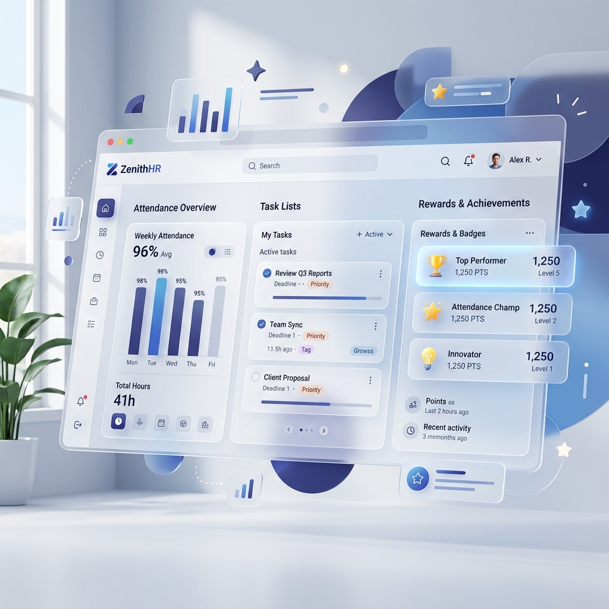
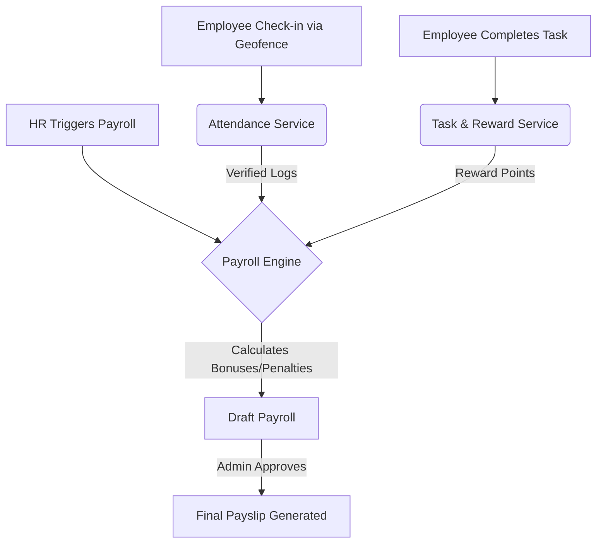

# TaskReward Workforce Operations Suite: Project & Client Guide

## Overview

TaskReward Workforce Operations Suite is a comprehensive enterprise platform tailored for SMEs (Small and Medium Enterprises) to manage their operations seamlessly. The platform unifies **Task Assignment**, **Smart Geofenced Attendance**, **Leave Workflows**, and an **Automated Payroll Engine** into a single, cohesive ecosystem powered by Gamification and AI-driven insights.

This guide outlines the features of the project and explains the **Client Journey**—how various roles across an organization interact with the product to streamline daily workflows.

---

## 🚀 Core Features

### 1. Gamified Task Management
Tasks are categorized, prioritized, and linked directly to an employee’s productivity score.
*   **Dynamic Priorities:** Critical, High, Medium, Regular, and Low tasks ensure resources are allocated effectively.
*   **Reward Points Engine:** Employees earn points based on the priority of the task. They receive a 1.1x multiplier for early completions and are penalized (down to 0 points) for overdue tasks.
*   **Recurrence Engine:** Automate daily, weekly, or monthly tasks seamlessly.

### 2. Geofence-Enabled Smart Attendance
Say goodbye to punch-cards and biometric scanners. Employees log their attendance directly via the mobile-friendly web app using their device's GPS.
*   **GPS Verification:** Captures precise lat/lng coordinates upon check-in and check-out.
*   **Drift Detection:** Flags anomalous sessions where the check-out location significantly diverges from the check-in location.
*   **Auto-Checkout:** A background service automatically closes stale sessions past working hours to maintain data integrity.

### 3. Automated Payroll Engine
The system bridges operational performance with financial compensation seamlessly.
*   **Dynamic Drafting:** Automatically pulls attendance records, approved leaves, and gamified reward points at the end of the month.
*   **Salary Structures:** Highly configurable basic, HRA, special allowances, PF, ESI, and tax deductions.
*   **Performance Bonuses:** Employees exceeding their target reward points automatically qualify for performance bonuses, while excessive backlogs incur penalties.

### 4. AI Workforce Intelligence
Empower the HR and Administrative teams with data-driven AI Copilots.
*   **AI Copilot:** A chat widget that allows management to ask natural language questions (e.g., "Who has the most overdue tasks this week?").
*   **Burnout Detection:** Predicts completion risks and flags overloaded assignees based on historical performance and current workloads.

---

## 👥 The Client Journey: How the Product is Used

TaskReward implements a strict **6-Tier Role-Based Access Control (RBAC)** system. Data visibility is "Bottom-Up", meaning managers can only see the data of employees who report directly to them.

### 🏢 1. The Admin (System Owner)
The Admin is the highest authority within a Tenant (Company).
*   **Setup:** The Admin seeds the organizational structure, creating Business Units (e.g., Headquarters, Remote Branch) and distinct Companies if operating under a group model.
*   **Oversight:** The Admin views global dashboards summarizing cross-branch attendance, payroll expenditures, and aggregate AI insights.
*   **Final Approval:** Admins hold the final key to locking monthly payroll drafts and converting them to "Paid" status.

### 👔 2. The HR Manager & Assistant HR
The HR team manages the human element of the operations.
*   **Onboarding:** Assistant HRs create new Employee profiles, assigning them to their operational Managers.
*   **Leave Management:** They review and approve PTO (Paid Time Off) and Sick Leave requests submitted by employees.
*   **Payroll Generation:** At the end of the month, the HR Manager triggers the "Draft Payroll" engine, reviews the auto-calculated deductions/bonuses, and pushes it up for Admin approval.

### 📊 3. The Manager & Assistant Manager
The operational heartbeat of the organization.
*   **Task Assignment:** Managers create tasks, set deadlines, and distribute workloads among their team.
*   **Performance Auditing:** They monitor their team's "Reward Points" leaderboards to identify high performers and address bottlenecks.
*   **Attendance Regularization:** Managers approve or reject requests from employees who missed a check-in or had technical issues with the Geofence.

### 👷 4. The Employee
The end-users who execute the daily work.
*   **Daily Check-In:** Upon arriving at the office (or approved remote site), the employee uses the dashboard to Check-In, validating their GPS location against the office Geofence.
*   **Task Execution:** Employees view their daily pending tasks, update statuses, and submit attachments or voice notes as proof of work.
*   **Gamification:** As tasks are completed, the employee's Reward Points increase, propelling them up the branch Leaderboard and securing their end-of-month bonuses.

---

## ⚙️ High-Level Architecture Workflow

*This diagram illustrates how daily employee actions (Check-ins and Tasks) automatically feed into the financial Payroll Engine.*

---

## Technical Stack Summary for IT Clients
*   **Frontend:** Next.js 16 (App Router), React 19, Tailwind CSS. Highly responsive design for desktop and mobile.
*   **Backend:** FastAPI (Python 3.12), Beanie ODM (MongoDB), Async I/O architecture capable of handling thousands of simultaneous Geofence pings.
*   **Security:** JSON Web Tokens (JWT), Bcrypt password hashing, and strict tenant-isolation middleware ensuring data from one business unit never leaks to another.
