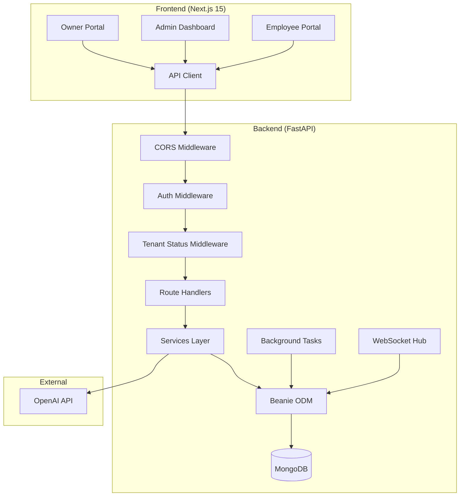
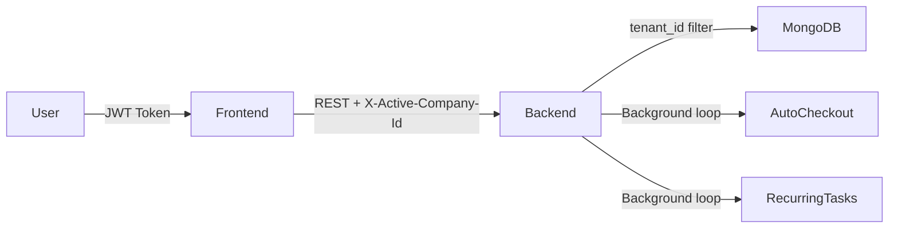

# 🏗️ ARCHITECT — Comprehensive Codebase Assessment Report

## Vision Employee Work Scheduler with Privacy

**Assessment Date:** 2026-06-06  
**Assessor:** ARCHITECT Agent (Elite Code Auditor)  
**Scope:** Full-stack application — Backend (FastAPI/Python) + Frontend (Next.js/React)

---

## Table of Contents

1. [Executive Summary](#1-executive-summary)
2. [Project Overview & Architecture](#2-project-overview--architecture)
3. [Technology Stack](#3-technology-stack)
4. [Architecture Analysis](#4-architecture-analysis)
5. [Bug Inventory](#5-bug-inventory)
6. [Security Audit](#6-security-audit)
7. [Performance Analysis](#7-performance-analysis)
8. [Technical Debt Inventory](#8-technical-debt-inventory)
9. [Code Quality Assessment](#9-code-quality-assessment)
10. [Test Coverage Analysis](#10-test-coverage-analysis)
11. [DevOps & CI/CD Assessment](#11-devops--cicd-assessment)
12. [Prioritized Recommendations](#12-prioritized-recommendations)

---

## 1. Executive Summary

### Overall Health Score: **62/100** ⚠️

| Category | Score | Grade |
|---|---|---|
| Architecture | 72/100 | B- |
| Code Quality | 65/100 | C+ |
| Security | 48/100 | D |
| Performance | 58/100 | D+ |
| Test Coverage | 30/100 | F |
| Documentation | 55/100 | D+ |
| Maintainability | 68/100 | C+ |

### Key Findings Summary

> [!CAUTION]
> **3 Critical Security Vulnerabilities** and **7 Critical Bugs** identified that require immediate attention before production deployment.

- **23 bugs** identified (7 Critical, 9 High, 7 Medium)
- **12 security vulnerabilities** (3 Critical, 5 High, 4 Medium)
- **8 performance bottlenecks** requiring optimization
- **No automated test pipeline** — backend tests exist but are not wired into CI
- **Seed script references stale model names** (`Company` instead of `Tenant`)

---

## 2. Project Overview & Architecture

### What the Application Does

**Vision Employee Work Scheduler** is a **multi-tenant SaaS workforce management platform** providing:

1. **Multi-tenant isolation** — Platform Owner onboards Tenants; each Tenant has an Admin who manages employees
2. **Role-based hierarchy** — 7 roles: `platform_owner > admin > manager/hr_manager > assistant_manager/assistant_hr_manager > employee`
3. **Attendance tracking** — GPS-based check-in/out with geofencing, anomaly detection, and device fingerprinting
4. **Task management** — Assignment, priority-based scoring, recurring tasks, AI risk analysis
5. **Performance rewards** — Dynamic points system (TaskReward) with ledger-based tracking and leaderboards
6. **Payroll engine** — Automated corporate payroll with attendance-based proration, LOP, bonuses, incentive tiers
7. **Leave management** — Multi-type leave system with approval workflows
8. **Regularization workflows** — Post-hoc attendance correction with approval chains
9. **AI Intelligence** — OpenAI-powered copilot + heuristic analytics (task risk, burnout detection, payroll anomaly)
10. **Real-time chat** — WebSocket-based messaging with file attachments
11. **Business Units** — Multi-unit support within a tenant for organizational segmentation
12. **Platform Owner Portal** — Super-admin dashboard for tenant lifecycle, plans, billing metrics

### Architecture Diagram

### Data Flow

---

## 3. Technology Stack

### Backend
| Component | Technology | Version |
|---|---|---|
| Framework | FastAPI | Latest |
| ODM | Beanie (MongoDB) | Latest |
| Auth | python-jose (JWT) + passlib (bcrypt) | — |
| WebSockets | FastAPI native | — |
| AI | OpenAI API (zero-dep urllib adapter) | gpt-4o-mini |
| Config | pydantic-settings | — |
| Package Manager | pip (requirements.txt) | — |

### Frontend
| Component | Technology | Version |
|---|---|---|
| Framework | Next.js | 15.x |
| Language | TypeScript | — |
| Styling | Tailwind CSS | — |
| Charts | Recharts | — |
| Icons | Lucide React | — |
| Package Manager | npm | — |

### Infrastructure
| Component | Technology |
|---|---|
| Database | MongoDB (local/Atlas) |
| CI/CD | GitHub Actions (frontend deploy only) |
| Deployment | GitHub Pages (frontend static export) |

---

## 4. Architecture Analysis

### Strengths ✅

1. **Clean multi-tenant isolation pattern** — [tenant_scope.py](file:///c:/Users/USER/Desktop/PROJECTS/Annaya_Projects/Vison_Employe_work_scheduler_with%20Privacy/backend/app/auth/tenant_scope.py) provides a centralized `require_tenant_id()` dependency that enforces data isolation at the route level
2. **Well-structured role hierarchy** — DFS-based circular dependency detection in [employees.py](file:///c:/Users/USER/Desktop/PROJECTS/Annaya_Projects/Vison_Employe_work_scheduler_with%20Privacy/backend/app/routes/employees.py#L28-L53) is thorough
3. **Ledger-based reward points** — [reward_service.py](file:///c:/Users/USER/Desktop/PROJECTS/Annaya_Projects/Vison_Employe_work_scheduler_with%20Privacy/backend/app/services/reward_service.py) uses an append-only ledger pattern with `sync_user_reward_points` aggregation, which is audit-friendly
4. **Comprehensive geofence system** — [geofence_utils.py](file:///c:/Users/USER/Desktop/PROJECTS/Annaya_Projects/Vison_Employe_work_scheduler_with%20Privacy/backend/app/services/geofence_utils.py) uses proper Haversine distance with configurable policies (strict/flexible/disabled)
5. **Payroll versioning** — `PayrollHistory` snapshots + version numbering prevents silent data loss during recalculations
6. **Audit logging** — [AuditService](file:///c:/Users/USER/Desktop/PROJECTS/Annaya_Projects/Vison_Employe_work_scheduler_with%20Privacy/backend/app/services/audit_service.py) and [PlatformAuditService](file:///c:/Users/USER/Desktop/PROJECTS/Annaya_Projects/Vison_Employe_work_scheduler_with%20Privacy/backend/app/services/platform_audit_service.py) capture before/after state diffs with IP and user-agent
7. **Policy versioning model** — [policy.py](file:///c:/Users/USER/Desktop/PROJECTS/Annaya_Projects/Vison_Employe_work_scheduler_with%20Privacy/backend/app/models/policy.py) supports effective date ranges for configuration changes
8. **Upload safety** — [uploads.py](file:///c:/Users/USER/Desktop/PROJECTS/Annaya_Projects/Vison_Employe_work_scheduler_with%20Privacy/backend/app/utils/uploads.py) uses UUID-prefixed filenames, content-type whitelisting, and streaming size limits

### Weaknesses ❌

1. **No service layer abstraction for routes** — Route files directly contain business logic (e.g., [payroll.py](file:///c:/Users/USER/Desktop/PROJECTS/Annaya_Projects/Vison_Employe_work_scheduler_with%20Privacy/backend/app/routes/payroll.py) is 1,210 lines with `calculate_corporate_payroll` as a 375-line function)
2. **Circular imports** — Routes import from other routes (e.g., `from app.routes.employees import get_visible_employee_ids` in [tasks.py](file:///c:/Users/USER/Desktop/PROJECTS/Annaya_Projects/Vison_Employe_work_scheduler_with%20Privacy/backend/app/routes/tasks.py#L39), [attendance.py](file:///c:/Users/USER/Desktop/PROJECTS/Annaya_Projects/Vison_Employe_work_scheduler_with%20Privacy/backend/app/routes/attendance.py#L312), [payroll.py](file:///c:/Users/USER/Desktop/PROJECTS/Annaya_Projects/Vison_Employe_work_scheduler_with%20Privacy/backend/app/routes/payroll.py#L440))
3. **Background tasks run in an unguarded infinite loop** — [main.py](file:///c:/Users/USER/Desktop/PROJECTS/Annaya_Projects/Vison_Employe_work_scheduler_with%20Privacy/backend/app/main.py#L44-L106) `while True` loop with no circuit breaker or health monitoring
4. **PolicyVersion model is defined but never consumed** — The route layer reads config directly from `Tenant`, ignoring `PolicyVersion` entirely
5. **Hardcoded employee name in payroll logic** — [payroll.py L334](file:///c:/Users/USER/Desktop/PROJECTS/Annaya_Projects/Vison_Employe_work_scheduler_with%20Privacy/backend/app/routes/payroll.py#L334): `if employee.name == "Shiva": role_targets[UserRole.EMPLOYEE] = 148.2`

---

## 5. Bug Inventory

### 🔴 CRITICAL (7)

#### BUG-001: Auto-checkout crashes on legacy Attendance documents missing `tenant_id`
- **Location:** [main.py L62-78](file:///c:/Users/USER/Desktop/PROJECTS/Annaya_Projects/Vison_Employe_work_scheduler_with%20Privacy/backend/app/main.py#L62-L78)
- **Impact:** The entire background task loop iteration fails with `ValidationError`, preventing ALL auto-checkouts system-wide
- **Root Cause:** `Attendance.tenant_id` is a required `PydanticObjectId` field, but legacy documents in MongoDB lack this field
- **Evidence:** User-reported error: `1 validation error for Attendance: tenant_id - Field required`
- **Fix:** Add `try/except` around individual record processing; create migration script to backfill `tenant_id` on orphaned documents

#### BUG-002: Seed script uses stale model name `Company` instead of `Tenant`
- **Location:** [seed_platform_owner.py L26-27](file:///c:/Users/USER/Desktop/PROJECTS/Annaya_Projects/Vison_Employe_work_scheduler_with%20Privacy/backend/seed_platform_owner.py#L26-L27)
- **Impact:** Seeder fails with `ImportError` — cannot bootstrap the platform owner account
- **Evidence:** `from app.models.company import Company` — this module does not exist; the model was renamed to `Tenant`
- **Fix:** Replace `Company` with `Tenant` import and update `init_beanie` call

#### BUG-003: `seed_platform_owner.py` sets `company_id=None` — field does not exist on User model
- **Location:** [seed_platform_owner.py L39, L54](file:///c:/Users/USER/Desktop/PROJECTS/Annaya_Projects/Vison_Employe_work_scheduler_with%20Privacy/backend/seed_platform_owner.py#L39)
- **Impact:** Pydantic validation error when seeding. The `User` model has `tenant_id`, not `company_id`
- **Fix:** Replace `company_id` with `tenant_id`

#### BUG-004: Payroll hardcodes employee-specific logic by name
- **Location:** [payroll.py L334-335](file:///c:/Users/USER/Desktop/PROJECTS/Annaya_Projects/Vison_Employe_work_scheduler_with%20Privacy/backend/app/routes/payroll.py#L334-L335)
- **Evidence:** `if employee.name == "Shiva": role_targets[UserRole.EMPLOYEE] = 148.2`
- **Impact:** One specific employee gets a different performance target hardcoded into the payroll engine — this is a data integrity issue that should be configurable per-tenant or per-employee

#### BUG-005: `tenant_id` fallback in check-in uses `current_user.id` as tenant_id
- **Location:** [attendance.py L171](file:///c:/Users/USER/Desktop/PROJECTS/Annaya_Projects/Vison_Employe_work_scheduler_with%20Privacy/backend/app/routes/attendance.py#L171)
- **Evidence:** `tenant_id=current_user.tenant_id or current_user.id`
- **Impact:** If a user has no `tenant_id`, the attendance record gets the user's own ObjectId as `tenant_id`. This creates orphaned data that cannot be queried by tenant filters and will cause downstream payroll/reporting failures

#### BUG-006: `get_tasks()` service inconsistent `user_id` type handling
- **Location:** [tasks.py L248-293](file:///c:/Users/USER/Desktop/PROJECTS/Annaya_Projects/Vison_Employe_work_scheduler_with%20Privacy/backend/app/routes/tasks.py#L248-L293)
- **Evidence:** Sometimes passes `user_id=str(current_user.id)`, sometimes `user_ids=list(visible_ids)`. The `visible_ids` set contains `PydanticObjectId` objects while `assigned_to` on tasks is stored as `PydanticObjectId`. String/ObjectId mismatches can cause empty query results
- **Impact:** Managers may see empty task lists despite having assigned tasks

#### BUG-007: `Attendance.find_one()` in check-in doesn't scope by `tenant_id`
- **Location:** [attendance.py L77-81](file:///c:/Users/USER/Desktop/PROJECTS/Annaya_Projects/Vison_Employe_work_scheduler_with%20Privacy/backend/app/routes/attendance.py#L77-L81)
- **Evidence:** Query only filters by `user_id` and date range — a user who somehow has records across tenants could have their duplicate-prevention fail
- **Impact:** Cross-tenant data leakage in the "already checked in" validation

---

### 🟠 HIGH (9)

#### BUG-008: `get_visible_employee_ids()` uses `.project({"_id": 1})` but accesses `e["_id"]` without type safety
- **Location:** [employees.py L206-210](file:///c:/Users/USER/Desktop/PROJECTS/Annaya_Projects/Vison_Employe_work_scheduler_with%20Privacy/backend/app/routes/employees.py#L206-L210)
- **Impact:** The projection returns raw dicts; Beanie's `project()` behavior varies by version — could silently return empty results

#### BUG-009: Leave calendar summary doesn't filter by date range for regularizations/leaves
- **Location:** [attendance.py L419-422](file:///c:/Users/USER/Desktop/PROJECTS/Annaya_Projects/Vison_Employe_work_scheduler_with%20Privacy/backend/app/routes/attendance.py#L419-L422)
- **Impact:** Fetches ALL approved regularizations for the user regardless of the 90-day window, causing unnecessary data transfer and potential performance issues

#### BUG-010: Payroll `calculate_corporate_payroll` uses `existing.dict()` instead of `existing.model_dump()`
- **Location:** [payroll.py L375](file:///c:/Users/USER/Desktop/PROJECTS/Annaya_Projects/Vison_Employe_work_scheduler_with%20Privacy/backend/app/routes/payroll.py#L375)
- **Impact:** Pydantic v2 deprecation warning; will break entirely when `dict()` is removed

#### BUG-011: `datetime.utcnow()` usage throughout the codebase
- **Locations:** [tenant.py L57](file:///c:/Users/USER/Desktop/PROJECTS/Annaya_Projects/Vison_Employe_work_scheduler_with%20Privacy/backend/app/models/tenant.py#L57), [user.py L44-46](file:///c:/Users/USER/Desktop/PROJECTS/Annaya_Projects/Vison_Employe_work_scheduler_with%20Privacy/backend/app/models/user.py#L44-L46), [jwt_handler.py L13](file:///c:/Users/USER/Desktop/PROJECTS/Annaya_Projects/Vison_Employe_work_scheduler_with%20Privacy/backend/app/auth/jwt_handler.py#L13), [payroll.py L458](file:///c:/Users/USER/Desktop/PROJECTS/Annaya_Projects/Vison_Employe_work_scheduler_with%20Privacy/backend/app/routes/payroll.py#L458)
- **Impact:** `datetime.utcnow()` is deprecated in Python 3.12+; should use `datetime.now(timezone.utc)`

#### BUG-012: `run_payroll_engine` date boundary off-by-one
- **Location:** [payroll.py L599-600](file:///c:/Users/USER/Desktop/PROJECTS/Annaya_Projects/Vison_Employe_work_scheduler_with%20Privacy/backend/app/routes/payroll.py#L599-L600)
- **Evidence:** `attn_start = datetime(year, month_num, 1)` — naive datetime without timezone, while attendance `check_in` is stored as UTC-aware. This comparison mismatch can cause off-by-one errors at UTC midnight boundaries

#### BUG-013: `get_my_attendance` route lacks pagination
- **Location:** [attendance.py L294-298](file:///c:/Users/USER/Desktop/PROJECTS/Annaya_Projects/Vison_Employe_work_scheduler_with%20Privacy/backend/app/routes/attendance.py#L294-L298)
- **Impact:** Returns ALL attendance records for a user — unbounded query that will degrade as data grows

#### BUG-014: Chat WebSocket message `sender_name` populated from DB lookup but `room_id` is user-controlled
- **Location:** Chat service and WebSocket handler
- **Impact:** Users can join arbitrary rooms by sending a crafted `room_id` — no tenant scoping on room membership

#### BUG-015: `RecurrenceRule` validator uses deprecated Pydantic v1 `@validator`
- **Location:** [recurring_task.py L51-61](file:///c:/Users/USER/Desktop/PROJECTS/Annaya_Projects/Vison_Employe_work_scheduler_with%20Privacy/backend/app/models/recurring_task.py#L51-L61)
- **Impact:** Will break under strict Pydantic v2 mode; should migrate to `@field_validator`

#### BUG-016: `update_employee` endpoint doesn't validate `tenant_id` scoping on the target employee
- **Location:** [employees.py L500](file:///c:/Users/USER/Desktop/PROJECTS/Annaya_Projects/Vison_Employe_work_scheduler_with%20Privacy/backend/app/routes/employees.py#L500)
- **Evidence:** `target_employee = await user_service.get_employee_by_id(employee_id)` — no `tenant_id` passed
- **Impact:** A management-team user could theoretically update an employee from another tenant if they knew the ObjectId

---

### 🟡 MEDIUM (7)

#### BUG-017: `get_all_attendance` doesn't handle the case where `current_user.tenant_id` is None
- **Location:** [attendance.py L316-317](file:///c:/Users/USER/Desktop/PROJECTS/Annaya_Projects/Vison_Employe_work_scheduler_with%20Privacy/backend/app/routes/attendance.py#L316-L317)

#### BUG-018: Payroll trend calculation month subtraction can produce invalid month numbers
- **Location:** [payroll.py L757-762](file:///c:/Users/USER/Desktop/PROJECTS/Annaya_Projects/Vison_Employe_work_scheduler_with%20Privacy/backend/app/routes/payroll.py#L757-L762)
- **Evidence:** Manual month arithmetic with `while m_num <= 0` — error-prone compared to using `dateutil.relativedelta`

#### BUG-019: Task `for_all` flag fetches ALL active users without tenant scoping
- **Location:** [tasks.py L63-67](file:///c:/Users/USER/Desktop/PROJECTS/Annaya_Projects/Vison_Employe_work_scheduler_with%20Privacy/backend/app/routes/tasks.py#L63-L67)
- **Evidence:** `await User.find(User.is_active == True).to_list()` — no tenant filter when `visible_ids` is None

#### BUG-020: `raw_password` field on User model
- **Location:** [user.py L25](file:///c:/Users/USER/Desktop/PROJECTS/Annaya_Projects/Vison_Employe_work_scheduler_with%20Privacy/backend/app/models/user.py#L25)
- **Impact:** Even though marked "deprecated", its presence in the model means it could be populated from legacy DB documents and serialized in API responses

#### BUG-021: `notify_task_assignees_on_completion` logic only notifies task creator, not other assignees
- **Location:** [tasks.py L409-417](file:///c:/Users/USER/Desktop/PROJECTS/Annaya_Projects/Vison_Employe_work_scheduler_with%20Privacy/backend/app/routes/tasks.py#L409-L417)

#### BUG-022: `permanent_delete_employee` doesn't cascade-delete related records (attendance, tasks, payroll, leaves)
- **Location:** [employees.py L656-686](file:///c:/Users/USER/Desktop/PROJECTS/Annaya_Projects/Vison_Employe_work_scheduler_with%20Privacy/backend/app/routes/employees.py#L656-L686)

#### BUG-023: Chat attachment upload has no tenant scoping — files are stored in a flat directory
- **Location:** Upload service stores files under `uploads/chat_attachments/` without tenant partitioning

---

## 6. Security Audit

### 🔴 CRITICAL (3)

#### SEC-001: Default JWT Secret is Insecure
- **Location:** [config.py L13](file:///c:/Users/USER/Desktop/PROJECTS/Annaya_Projects/Vison_Employe_work_scheduler_with%20Privacy/backend/app/config.py#L13)
- **Evidence:** `JWT_SECRET: str = "change-this-secret"`
- **Impact:** Anyone can forge JWT tokens if the default secret is used in production
- **Mitigation:** The codebase defines `INSECURE_JWT_SECRETS` on [L7](file:///c:/Users/USER/Desktop/PROJECTS/Annaya_Projects/Vison_Employe_work_scheduler_with%20Privacy/backend/app/config.py#L7) and a `uses_insecure_jwt_secret` property, but **this check is never enforced at startup**
- **Fix:** Add a startup guard that refuses to boot with an insecure secret in production mode

#### SEC-002: CORS Allows All Origins by Default
- **Location:** [config.py L16](file:///c:/Users/USER/Desktop/PROJECTS/Annaya_Projects/Vison_Employe_work_scheduler_with%20Privacy/backend/app/config.py#L16)
- **Evidence:** `CORS_ORIGINS: str = "*"` and the middleware in [main.py](file:///c:/Users/USER/Desktop/PROJECTS/Annaya_Projects/Vison_Employe_work_scheduler_with%20Privacy/backend/app/main.py) uses `allow_origins=settings.cors_origins_list` + `allow_credentials=True`
- **Impact:** Any website can make authenticated cross-origin requests to the API — combined with JWT in headers this is a credential theft vector
- **Fix:** Restrict to specific origins; never use `*` with `allow_credentials=True`

#### SEC-003: Platform Owner password reset returns plaintext temp password in API response
- **Location:** [platform.py L380-386](file:///c:/Users/USER/Desktop/PROJECTS/Annaya_Projects/Vison_Employe_work_scheduler_with%20Privacy/backend/app/routes/platform.py#L380-L386)
- **Evidence:** `"temp_password": temp_password` — HTTP response body contains plaintext password
- **Impact:** Network intercept, proxy logs, or browser developer tools expose the password
- **Fix:** Send via email/SMS instead; or at minimum require HTTPS enforcement

---

### 🟠 HIGH (5)

#### SEC-004: No rate limiting on authentication endpoints
- **Location:** [auth.py login route](file:///c:/Users/USER/Desktop/PROJECTS/Annaya_Projects/Vison_Employe_work_scheduler_with%20Privacy/backend/app/routes/auth.py), [platform.py L114](file:///c:/Users/USER/Desktop/PROJECTS/Annaya_Projects/Vison_Employe_work_scheduler_with%20Privacy/backend/app/routes/platform.py#L114)
- **Impact:** Brute-force password attacks are unrestricted
- **Fix:** Add `slowapi` or token-bucket rate limiter to login endpoints

#### SEC-005: JWT tokens have no refresh mechanism — 8-hour expiry with no rotation
- **Location:** [config.py L15](file:///c:/Users/USER/Desktop/PROJECTS/Annaya_Projects/Vison_Employe_work_scheduler_with%20Privacy/backend/app/config.py#L15) — `ACCESS_TOKEN_EXPIRE_MINUTES: int = 480`
- **Impact:** Long-lived tokens increase the window for token theft; no way to invalidate a compromised token

#### SEC-006: Tenant admin onboarding returns temp password in response body
- **Location:** [platform.py L436-437](file:///c:/Users/USER/Desktop/PROJECTS/Annaya_Projects/Vison_Employe_work_scheduler_with%20Privacy/backend/app/routes/platform.py#L436-L437)
- **Same risk as SEC-003**

#### SEC-007: File upload path traversal risk — `upload_dir` is relative
- **Location:** [uploads.py L63-64](file:///c:/Users/USER/Desktop/PROJECTS/Annaya_Projects/Vison_Employe_work_scheduler_with%20Privacy/backend/app/utils/uploads.py#L63-L64)
- **Evidence:** `destination_dir = Path(upload_dir)` — if a caller passes a relative path like `../../etc/`, files could be written outside the intended directory
- **Mitigation:** The caller currently uses hardcoded paths, but the utility function itself is unsafe
- **Fix:** Resolve and validate the final path is within an allowed base directory

#### SEC-008: No input sanitization on search parameters
- **Location:** [platform.py L198](file:///c:/Users/USER/Desktop/PROJECTS/Annaya_Projects/Vison_Employe_work_scheduler_with%20Privacy/backend/app/routes/platform.py#L198)
- **Evidence:** `query["name"] = {"$regex": search, "$options": "i"}` — user-controlled regex injected directly into MongoDB query
- **Impact:** ReDoS (Regular Expression Denial of Service) — a crafted regex pattern can hang the database

---

### 🟡 MEDIUM (4)

#### SEC-009: `raw_password` field can leak in API responses
- **Location:** [user.py L25](file:///c:/Users/USER/Desktop/PROJECTS/Annaya_Projects/Vison_Employe_work_scheduler_with%20Privacy/backend/app/models/user.py#L25)
- **Fix:** Add `exclude={"raw_password", "password_hash"}` to all user serialization

#### SEC-010: WebSocket connections lack tenant scoping
- **Impact:** A user from Tenant A could potentially join a chat room belonging to Tenant B

#### SEC-011: OpenAI API key in environment without rotation/vault management
- **Location:** [ai_service.py L26](file:///c:/Users/USER/Desktop/PROJECTS/Annaya_Projects/Vison_Employe_work_scheduler_with%20Privacy/backend/app/services/ai_service.py#L26)

#### SEC-012: Static file serving without authentication
- **Impact:** Uploaded identity documents and chat attachments served via `/uploads/` path may be accessible without auth

---

## 7. Performance Analysis

### 🔴 Critical Bottlenecks

#### PERF-001: Payroll summary makes 6 sequential DB queries for trend data
- **Location:** [payroll.py L755-773](file:///c:/Users/USER/Desktop/PROJECTS/Annaya_Projects/Vison_Employe_work_scheduler_with%20Privacy/backend/app/routes/payroll.py#L755-L773)
- **Evidence:** `for i in range(5, -1, -1):` loop with `await Payroll.find(...)` inside — 6 sequential queries
- **Fix:** Use a single MongoDB aggregation with `$group` by month

#### PERF-002: `get_visible_employee_ids()` called redundantly per request
- **Location:** Multiple routes call this function independently, even within the same request lifecycle
- **Fix:** Cache result in request state or use a FastAPI dependency with caching

#### PERF-003: Payroll engine runs N+1 queries per employee during batch processing
- **Location:** [payroll.py L615-636](file:///c:/Users/USER/Desktop/PROJECTS/Annaya_Projects/Vison_Employe_work_scheduler_with%20Privacy/backend/app/routes/payroll.py#L615-L636)
- **Evidence:** `for emp in employees: await calculate_corporate_payroll(...)` — each call fetches Tenant, SalaryStructure, Attendance, Leaves, Holidays independently
- **Fix:** Pre-fetch shared data (tenant, holidays) outside the loop

#### PERF-004: `get_all_attendance` returns unbounded results
- **Location:** [attendance.py L300-332](file:///c:/Users/USER/Desktop/PROJECTS/Annaya_Projects/Vison_Employe_work_scheduler_with%20Privacy/backend/app/routes/attendance.py#L300-L332)
- **Fix:** Add pagination parameters

### 🟡 Moderate Bottlenecks

#### PERF-005: AI dashboard intelligence runs 4 sequential analysis passes
- **Location:** [ai_service.py L564-570](file:///c:/Users/USER/Desktop/PROJECTS/Annaya_Projects/Vison_Employe_work_scheduler_with%20Privacy/backend/app/services/ai_service.py#L564-L570)
- **Fix:** Use `asyncio.gather()` to parallelize independent analyses

#### PERF-006: Missing compound indexes on frequently queried fields
- **Impact:** `Attendance` queries by `(user_id, check_in)` and `(tenant_id, business_unit_id, check_in)` lack compound indexes
- **Fix:** Add compound indexes in the `Settings` class

#### PERF-007: Platform `/tenants` endpoint makes N+1 queries for employee counts
- **Location:** [platform.py L212-214](file:///c:/Users/USER/Desktop/PROJECTS/Annaya_Projects/Vison_Employe_work_scheduler_with%20Privacy/backend/app/routes/platform.py#L212-L214)

#### PERF-008: Background task loop has 60-second fixed sleep regardless of load
- **Location:** [main.py L103-106](file:///c:/Users/USER/Desktop/PROJECTS/Annaya_Projects/Vison_Employe_work_scheduler_with%20Privacy/backend/app/main.py#L103-L106)
- **Fix:** Use adaptive scheduling or external task scheduler (Celery, APScheduler)

---

## 8. Technical Debt Inventory

| ID | Category | Description | Location | Effort |
|---|---|---|---|---|
| TD-001 | Model Renaming | `Company` → `Tenant` migration incomplete in seed script | [seed_platform_owner.py](file:///c:/Users/USER/Desktop/PROJECTS/Annaya_Projects/Vison_Employe_work_scheduler_with%20Privacy/backend/seed_platform_owner.py) | Low |
| TD-002 | Dead Code | `PolicyVersion` model defined but never used by any route | [policy.py](file:///c:/Users/USER/Desktop/PROJECTS/Annaya_Projects/Vison_Employe_work_scheduler_with%20Privacy/backend/app/models/policy.py) | Medium |
| TD-003 | Architecture | Route files contain business logic (payroll.py = 1,210 lines) | Routes layer | High |
| TD-004 | Circular Imports | Routes importing from other routes (should be in services) | `employees.py → tasks.py → employees.py` cycle | Medium |
| TD-005 | Deprecated API | `datetime.utcnow()` used ~15 times across codebase | Multiple files | Low |
| TD-006 | Deprecated API | Pydantic v1 `@validator` used in `RecurrenceRule` | [recurring_task.py](file:///c:/Users/USER/Desktop/PROJECTS/Annaya_Projects/Vison_Employe_work_scheduler_with%20Privacy/backend/app/models/recurring_task.py) | Low |
| TD-007 | Deprecated API | `.dict()` used instead of `.model_dump()` | [payroll.py L375](file:///c:/Users/USER/Desktop/PROJECTS/Annaya_Projects/Vison_Employe_work_scheduler_with%20Privacy/backend/app/routes/payroll.py#L375) | Low |
| TD-008 | Hardcoded Values | Employee name "Shiva" hardcoded in payroll | [payroll.py L334](file:///c:/Users/USER/Desktop/PROJECTS/Annaya_Projects/Vison_Employe_work_scheduler_with%20Privacy/backend/app/routes/payroll.py#L334) | Low |
| TD-009 | Missing Feature | `ApprovalPolicy` model unused — approval workflows are implicit | [policy.py L93-106](file:///c:/Users/USER/Desktop/PROJECTS/Annaya_Projects/Vison_Employe_work_scheduler_with%20Privacy/backend/app/models/policy.py#L93-L106) | Medium |
| TD-010 | Inconsistency | `hiring_date` stored as `Optional[str]` instead of `datetime` | [user.py L54](file:///c:/Users/USER/Desktop/PROJECTS/Annaya_Projects/Vison_Employe_work_scheduler_with%20Privacy/backend/app/models/user.py#L54) | Medium |
| TD-011 | Missing Feature | No database migration tooling (no Alembic/mongock equivalent) | — | High |
| TD-012 | Architecture | AI service uses `urllib` instead of `httpx`/`aiohttp` for async-safe HTTP | [ai_service.py L49-61](file:///c:/Users/USER/Desktop/PROJECTS/Annaya_Projects/Vison_Employe_work_scheduler_with%20Privacy/backend/app/services/ai_service.py#L49-L61) | Medium |

---

## 9. Code Quality Assessment

### Positive Patterns ✅

- **Consistent docstrings** on all route handlers and service functions
- **Type hints** used extensively (Pydantic models, function signatures)
- **Enum-based roles and statuses** prevent magic strings
- **Audit trail pattern** consistently applied across CRUD operations
- **Index definitions** on most models
- **Notification service** decouples alert logic from business logic

### Anti-Patterns ⚠️

1. **God functions** — `calculate_corporate_payroll` is 375 lines mixing data fetching, business logic, and persistence
2. **Import-time side effects** — `from app.routes.employees import get_visible_employee_ids` inside route handler bodies creates hidden coupling
3. **String-typed IDs in some places, ObjectId in others** — inconsistent `str(id)` vs `PydanticObjectId` across task routes
4. **No request validation middleware** — individual routes validate `tenant_id` manually instead of a global middleware
5. **Exception swallowing** — [attendance.py L289-290](file:///c:/Users/USER/Desktop/PROJECTS/Annaya_Projects/Vison_Employe_work_scheduler_with%20Privacy/backend/app/routes/attendance.py#L289-L290): `except Exception as e: logger.warning(...)` on payroll recalculation silently hides failures

### Metrics

| Metric | Value | Assessment |
|---|---|---|
| Backend Python Files | ~45 | Moderate complexity |
| Largest File | payroll.py (1,210 lines) | Too large — split needed |
| Average Route File | ~400 lines | Acceptable |
| Models | 18 Beanie Documents | Well-organized |
| Services | 12 service modules | Good separation |
| Route Modules | 12 routers | Well-organized |

---

## 10. Test Coverage Analysis

### Backend Tests

| File | Purpose | Status |
|---|---|---|
| [test_immediate_fixes.py](file:///c:/Users/USER/Desktop/PROJECTS/Annaya_Projects/Vison_Employe_work_scheduler_with%20Privacy/backend/tests/test_immediate_fixes.py) | Regression tests | ✅ Exists |
| [test_payroll.py](file:///c:/Users/USER/Desktop/PROJECTS/Annaya_Projects/Vison_Employe_work_scheduler_with%20Privacy/backend/tests/test_payroll.py) | Payroll engine tests | ✅ Exists |
| [test_phase2_short_term.py](file:///c:/Users/USER/Desktop/PROJECTS/Annaya_Projects/Vison_Employe_work_scheduler_with%20Privacy/backend/tests/test_phase2_short_term.py) | Phase 2 regression | ✅ Exists |
| [test_security_remediation.py](file:///c:/Users/USER/Desktop/PROJECTS/Annaya_Projects/Vison_Employe_work_scheduler_with%20Privacy/backend/tests/test_security_remediation.py) | Security fixes tests | ✅ Exists |
| Auth routes tests | — | ❌ Missing |
| Attendance routes tests | — | ❌ Missing |
| Employee CRUD tests | — | ❌ Missing |
| Task management tests | — | ❌ Missing |
| Platform owner tests | — | ❌ Missing |
| Integration tests | — | ❌ Missing |

### Frontend Tests

| File | Purpose | Status |
|---|---|---|
| [accessibility.test.ts](file:///c:/Users/USER/Desktop/PROJECTS/Annaya_Projects/Vison_Employe_work_scheduler_with%20Privacy/frontend/src/__tests__/accessibility.test.ts) | A11y checks | ✅ Exists |
| E2E tests (7 specs) | Business units, isolation, etc. | ✅ Exists |
| Component unit tests | — | ❌ Missing |
| API integration tests | — | ❌ Missing |

> [!WARNING]
> **Estimated test coverage: <15%** — No backend tests are executed in the CI pipeline. The GitHub Actions workflow only runs `npm run lint` and `npm run build` for the frontend.

---

## 11. DevOps & CI/CD Assessment

### Current Pipeline

### Gaps

| Category | Status | Notes |
|---|---|---|
| Backend CI/CD | ❌ None | No test, lint, or deployment pipeline for backend |
| Backend Deployment | ❌ Manual | No containerization, no Dockerfile |
| Database Migrations | ❌ None | No migration framework |
| Environment Separation | ❌ Minimal | Only `ENVIRONMENT` flag; no staging environment |
| Secrets Management | ❌ Basic | `.env` file only; no vault integration |
| Health Checks | ⚠️ Basic | Only `/platform/system-health` for platform owners |
| Monitoring | ❌ None | No APM, error tracking, or alerting |
| Docker | ❌ Missing | No Dockerfile or docker-compose |
| Load Testing | ❌ None | — |

---

## 12. Prioritized Recommendations

### 🔴 P0 — Immediate (Do Now)

| # | Action | Effort | Impact |
|---|---|---|---|
| 1 | **Fix auto-checkout crash** (BUG-001): Wrap individual record processing in try/except; add `tenant_id` backfill migration | 2h | Critical — system stability |
| 2 | **Fix seed script** (BUG-002, BUG-003): Update imports and field names | 15m | Critical — bootstrapping broken |
| 3 | **Enforce JWT secret check at startup** (SEC-001): Refuse to start with insecure secret in production | 30m | Critical — token forgery |
| 4 | **Restrict CORS origins** (SEC-002): Remove `*` default; require explicit origin configuration | 15m | Critical — credential theft |
| 5 | **Add rate limiting to auth endpoints** (SEC-004): Install `slowapi` with IP-based throttling | 1h | High — brute force prevention |
| 6 | **Fix tenant_id fallback in check-in** (BUG-005): Raise 400 error instead of falling back to user.id | 15m | Critical — data corruption |
| 7 | **Remove hardcoded "Shiva" payroll logic** (BUG-004): Move to per-employee or per-tenant configurable targets | 30m | Critical — data integrity |

### 🟠 P1 — Short-Term (This Sprint)

| # | Action | Effort | Impact |
|---|---|---|---|
| 8 | **Add tenant scoping to update_employee** (BUG-016): Pass `tenant_id` to service call | 30m | High — cross-tenant isolation |
| 9 | **Add pagination to attendance endpoints** (BUG-013, PERF-004) | 2h | High — performance |
| 10 | **Fix payroll N+1 queries** (PERF-003): Pre-fetch tenant/holidays outside loop | 3h | High — performance |
| 11 | **Add compound indexes to Attendance model** (PERF-006) | 30m | High — query performance |
| 12 | **Migrate deprecated APIs** (BUG-010, BUG-011, BUG-015): `.dict()` → `.model_dump()`, `datetime.utcnow()` → `datetime.now(UTC)`, `@validator` → `@field_validator` | 2h | Medium — future compatibility |
| 13 | **Add payroll summary aggregation** (PERF-001): Replace 6-query loop with single `$group` | 2h | High — performance |
| 14 | **Parallelize AI analyses** (PERF-005): Use `asyncio.gather()` in dashboard intelligence | 1h | Medium — latency |
| 15 | **Scope check-in duplicate check by tenant** (BUG-007) | 15m | High — data isolation |
| 16 | **Remove `raw_password` from User model serialization** (SEC-009): Add `model_config` exclusion | 30m | Medium — security |
| 17 | **Sanitize regex in search endpoints** (SEC-008): Escape special chars or use `$text` search | 1h | High — DoS prevention |

### 🟡 P2 — Medium-Term (Next 2-4 Sprints)

| # | Action | Effort | Impact |
|---|---|---|---|
| 18 | **Extract business logic from routes into services** (TD-003): Split `calculate_corporate_payroll` into smaller functions | 2 days | High — maintainability |
| 19 | **Resolve circular imports** (TD-004): Move `get_visible_employee_ids` to a service module | 4h | Medium — architecture |
| 20 | **Implement database migration tooling** (TD-011): Add MongoDB migration scripts with versioning | 1 day | High — operational safety |
| 21 | **Add backend CI/CD pipeline**: pytest + coverage + lint in GitHub Actions | 4h | High — quality assurance |
| 22 | **Create Dockerfile and docker-compose** for local dev and deployment | 4h | High — deployment |
| 23 | **Add refresh token mechanism** (SEC-005): Implement token rotation with short-lived access + long-lived refresh | 1 day | Medium — security |
| 24 | **Add tenant scoping to WebSocket chat** (SEC-010): Validate room membership against tenant | 4h | Medium — data isolation |
| 25 | **Integrate error tracking** (Sentry or equivalent) | 2h | Medium — observability |
| 26 | **Implement PolicyVersion consumption**: Wire routes to read from PolicyVersion instead of directly from Tenant (TD-002) | 2 days | Medium — feature completion |
| 27 | **Add cascade delete for permanent_delete_employee** (BUG-022) | 3h | Medium — data cleanup |
| 28 | **Replace urllib with httpx/aiohttp in AI service** (TD-012) | 2h | Medium — async safety |

### 🔵 P3 — Long-Term (Backlog)

| # | Action | Effort | Impact |
|---|---|---|---|
| 29 | **Implement approval workflow engine** using `ApprovalPolicy` model (TD-009) | 1 week | Medium — feature |
| 30 | **Add comprehensive E2E test suite** for all backend routes | 1 week | High — quality |
| 31 | **Implement secrets vault** (HashiCorp Vault or AWS Secrets Manager) | 2 days | Medium — security |
| 32 | **Add APM/monitoring** (Prometheus + Grafana or Datadog) | 2 days | Medium — observability |
| 33 | **Implement background task framework** (Celery + Redis) to replace `while True` loop | 3 days | Medium — reliability |
| 34 | **Migrate `hiring_date` to datetime type** (TD-010) | 4h | Low — data quality |
| 35 | **Add tenant-partitioned file storage** for uploads (BUG-023) | 4h | Low — data isolation |

---

## Appendix: File Reference Map

### Key Backend Files

| File | Purpose | Lines | Risk Level |
|---|---|---|---|
| [main.py](file:///c:/Users/USER/Desktop/PROJECTS/Annaya_Projects/Vison_Employe_work_scheduler_with%20Privacy/backend/app/main.py) | App entry + background tasks | 137 | 🔴 High |
| [config.py](file:///c:/Users/USER/Desktop/PROJECTS/Annaya_Projects/Vison_Employe_work_scheduler_with%20Privacy/backend/app/config.py) | Settings + security defaults | 41 | 🔴 High |
| [tenant_scope.py](file:///c:/Users/USER/Desktop/PROJECTS/Annaya_Projects/Vison_Employe_work_scheduler_with%20Privacy/backend/app/auth/tenant_scope.py) | Tenant isolation | 55 | 🔴 Critical |
| [middleware.py](file:///c:/Users/USER/Desktop/PROJECTS/Annaya_Projects/Vison_Employe_work_scheduler_with%20Privacy/backend/app/middleware.py) | Status/auth middleware | ~100 | 🟠 Medium |
| [payroll.py](file:///c:/Users/USER/Desktop/PROJECTS/Annaya_Projects/Vison_Employe_work_scheduler_with%20Privacy/backend/app/routes/payroll.py) | Payroll engine + routes | 1,210 | 🔴 High |
| [employees.py](file:///c:/Users/USER/Desktop/PROJECTS/Annaya_Projects/Vison_Employe_work_scheduler_with%20Privacy/backend/app/routes/employees.py) | Employee CRUD + hierarchy | 687 | 🟠 Medium |
| [tasks.py](file:///c:/Users/USER/Desktop/PROJECTS/Annaya_Projects/Vison_Employe_work_scheduler_with%20Privacy/backend/app/routes/tasks.py) | Task management | 508 | 🟠 Medium |
| [attendance.py](file:///c:/Users/USER/Desktop/PROJECTS/Annaya_Projects/Vison_Employe_work_scheduler_with%20Privacy/backend/app/routes/attendance.py) | Attendance + geofencing | 609 | 🟠 Medium |
| [platform.py](file:///c:/Users/USER/Desktop/PROJECTS/Annaya_Projects/Vison_Employe_work_scheduler_with%20Privacy/backend/app/routes/platform.py) | Platform owner portal | 665 | 🟡 Low |
| [ai_service.py](file:///c:/Users/USER/Desktop/PROJECTS/Annaya_Projects/Vison_Employe_work_scheduler_with%20Privacy/backend/app/services/ai_service.py) | AI intelligence engine | 775 | 🟡 Low |
| [reward_service.py](file:///c:/Users/USER/Desktop/PROJECTS/Annaya_Projects/Vison_Employe_work_scheduler_with%20Privacy/backend/app/services/reward_service.py) | Performance scoring | 162 | 🟡 Low |
| [geofence_utils.py](file:///c:/Users/USER/Desktop/PROJECTS/Annaya_Projects/Vison_Employe_work_scheduler_with%20Privacy/backend/app/services/geofence_utils.py) | GPS utilities | 115 | 🟢 Clean |
| [uploads.py](file:///c:/Users/USER/Desktop/PROJECTS/Annaya_Projects/Vison_Employe_work_scheduler_with%20Privacy/backend/app/utils/uploads.py) | File upload safety | 93 | 🟢 Clean |

---

> **End of ARCHITECT Assessment Report**  
> Total findings: **23 bugs** • **12 security issues** • **8 performance bottlenecks** • **12 technical debt items**  
> Recommended immediate action items: **7 (P0)**
